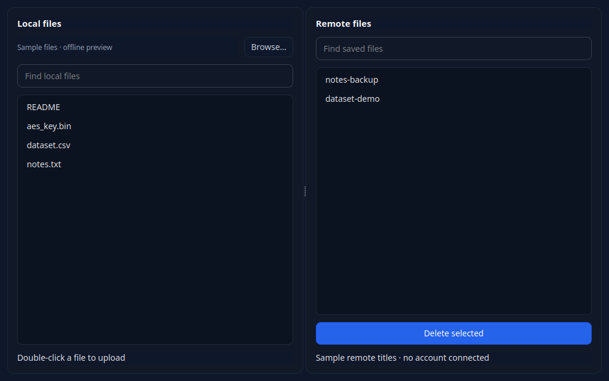

# YouTube Drive

An experimental encrypted file-to-video codec with a PyQt6 interface and YouTube Studio automation. It converts a local file into an MP4, uploads it through a signed-in YouTube Studio session, and can download and attempt to decode a selected video.

This is a proof of concept, not a storage product. A successful local encode/decode round trip only checks the codec before YouTube processes the video; it does **not** establish that a file can be recovered after YouTube transcoding, downloading, or future changes to YouTube Studio.

> **Disclaimer:** This project is for educational and research purposes only. Using YouTube as a file storage system likely violates YouTube's Terms of Service. The author is not responsible for any account bans, data loss, or other consequences. Use at your own risk.



*Offline UI preview with sample local files and a simulated remote list; no account is connected.*

## What it does

The upload path is:

1. Compress the selected file with Zstandard.
2. Add metadata for the original file name, extension, and compressed payload size.
3. Encrypt the resulting bytes with AES-EAX using a locally generated key.
4. Add Reed-Solomon error-correction bytes.
5. Convert the bit stream into black-and-white pixel blocks and encode it as H.264 (`libx264`) MP4 with FFmpeg.
6. Use Playwright to upload the MP4 as a private YouTube video.

The download path reverses those operations: it downloads a video, extracts RGB frames with FFmpeg, reconstructs the bit stream, applies Reed-Solomon decoding, authenticates/decrypts the bytes, decompresses them, and writes the recovered file.

## Requirements

- Python 3.10–3.13. The project currently pins `numpy==2.2.6`; it does not claim compatibility with newer Python releases. Current local checks use Python 3.12.
- FFmpeg on `PATH`, built with the `libx264` encoder.
- Firefox installed for Playwright.

On Linux, `playwright install firefox` may report missing browser-system dependencies. Install the packages it identifies for your distribution only if that happens.

## Installation

Clone the repository and enter it:

```bash
git clone https://github.com/Eb3ls/youtube_drive.git
cd youtube_drive
```

Create and activate a virtual environment.

Unix-like shells:

```bash
python3 -m venv .venv
source .venv/bin/activate
```

Windows PowerShell:

```powershell
py -3 -m venv .venv
.\.venv\Scripts\Activate.ps1
```

Install the Python packages and the Firefox browser used by Playwright:

```bash
pip install -r requirements.txt
playwright install firefox
```

## Usage

Launch the application from the folder where you want its session state to live:

```bash
python app.py
```

On first use, Firefox opens YouTube Studio. Sign in in that browser window, then return to the terminal and press Enter. The application saves `yt_cookies.json` and creates `aes_key.bin` in the launch working directory. They remain there even if you later browse to a different local directory in the GUI.

Reuse the same launch folder for a given set of files, and back up `aes_key.bin` securely. Without the matching key, encrypted data cannot be decrypted. `yt_cookies.json` contains browser session state; keep it private and do not commit or share it.

Double-click a local file to encode and upload it. Choose a unique title that is safe to use as a file name; the application rejects path separators, invalid filename characters, Windows device names, and titles already present in the visible remote list. Double-click a remote title to download and decode it. If multiple visible videos have the same exact title, rename them in YouTube Studio first. The app preserves names without an extension and writes recovered files into the active local directory, adding a numeric suffix if a file already exists.

## Operating limits

- The remote list contains **all videos currently visible in the signed-in YouTube Studio account**, not only videos created by this application. The **Delete selected** button permanently deletes the selected video; the automation accepts YouTube's confirmation dialog. The local checks below do not access a live account.
- The codec holds complete inputs and frame buffers in memory. Each `640 × 360` RGB frame takes `691,200` bytes and carries `7,200` data bytes: a 96-fold expansion, plus padding to whole frames. Even small inputs produce at least six frames (`4,147,200` raw bytes). These are buffer sizes calculated from the code; peak memory is higher because of additional NumPy arrays and compressed/encrypted copies.
- Files are processed through temporary upload/download locations. The codec itself is not a streaming implementation, so memory requirements rise with the encoded payload size.
- YouTube may transcode uploads, alter download availability, limit accounts, or change its Studio interface. Reed-Solomon redundancy is present, but recovery after those transformations is unverified.
- The Playwright automation relies on YouTube Studio selectors and an English-language interface; changes to either can break upload, list, download, or delete actions.

## Local verification

The default test suite requires FFmpeg and the Python dependencies, but no browser or YouTube account. From an activated environment, run:

```bash
python -m unittest discover -s tests -v
```

The GUI tests use Qt's offscreen mode automatically. They cover transfer-file safety and cleanup on failures; the codec tests run real FFmpeg round trips with binary data, empty files, Unicode names, extensionless files, and existing destination files.

Optional selector tests exercise the browser automation against local HTML fixtures. Install Chromium and enable them on Unix-like shells:

```bash
playwright install chromium
YOUTUBE_DRIVE_TEST_BROWSER=chromium python -m unittest discover -s tests -v
```

In PowerShell, set `$env:YOUTUBE_DRIVE_TEST_BROWSER = "chromium"` before running the test command. Without this setting, the browser-specific tests are skipped. A custom Chromium executable path can also be supplied as the variable's value.

These tests cover local behavior only. HTML fixtures validate title-selection logic, but they do not establish compatibility with the current YouTube Studio page, upload behavior, YouTube transcoding, or recovery from a live account.

## Author

Leonardo Berselli

## License

See [LICENSE](LICENSE).
